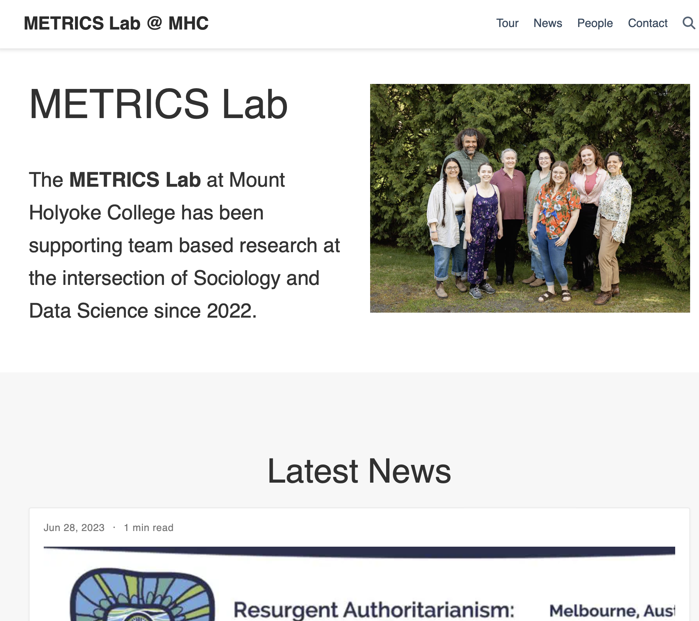

# [METRICS Lab at Mount Holyoke College Website](https://mhc-metrics-lab.github.io)

)

This repo hosts code for the **METRICS LAB** website. 

## Template

This website uses an open source template:

- [Hugo Research Group Template on GitHub repo](https://github.com/wowchemy/starter-hugo-research-group)
- [Hugo Reseearch Group Template on HugoBlox](https://hugoblox.com/templates/details/research-group/)
- [Hugo Reseearch Group Template Demo Site](https://research-group.netlify.app)

## Technologies and Installation

This template uses [Hugo](https://github.com/gohugoio/hugo), a static website engine. Most of the code that requires editing is presented in markdown and the code can be deployed using the GitHub web interface (including **Code Spaces**) exclusively.

This template can be deployed from the [Hugo Research Group GitHub repo](https://github.com/wowchemy/starter-hugo-research-group) by selecting _Create a New Repository_ from the _Use this template_ menu. Once the repo has been cloned it can be customized by following the [instructions in the documentation](https://docs.hugoblox.com/tutorial/blog/).

### [Please consider supporting the developers of this template](https://github.com/sponsors/gcushen)!

## Adding content and making changes

METRICS members may use the GitHub web interface to create new content and edit markdown files. Further instructions are coming soon.

## Photo credits

A big **thank you** to Mykelle Walton for taking the amazing original images of the lab included on the site.
